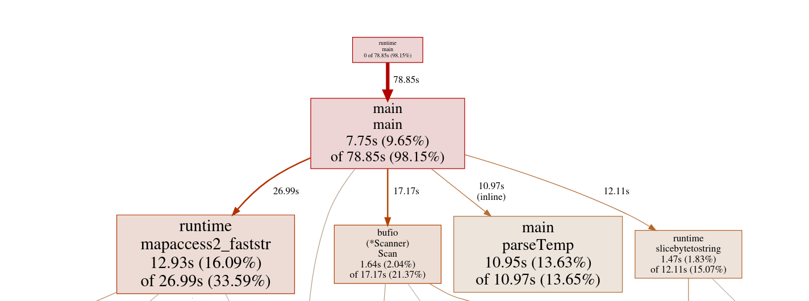

# GoProfiling

## Week 1
Wrote a very basic solution to test the correctness. The initial tests were run on 100M rows and it completed in ~13 seconds. Now running it on 1 Billion rows is taking ~2min 10seconds.

## Week 2
* Added Profiling to the code
* Read Bytes instead of string

| Bottleneck | Impact (~%) | Root Cause | Plan |
| :--- | :--- | :--- | :--- |
| **Memory Allocation** | 28% | Creating new strings/slices for every line. | Switch to `scanner.Bytes()`; reuse buffers. (Done) |
| **String Splitting** | 23% | `strings.SplitN` is too generic and allocates. | Manually find the `;` delimiter in byte slice. |
| **Map Lookups** | 22% | Hashing and comparing string keys is slow. | Reduce unnecessary byte-to-string conversions. |
| **Float Parsing** | 18% | Standard library parsing is overkill for simple data. | Use custom integer-based parsing. |

Running for 1 Billion takes ~1m23sec

## Week 3

* Added a custom float parsing function (Reduced Runtime by very small amount)

Parsing is still taking considerable amount of time. I need to look into whether i can make parsing faster than this or not. The next challenge is to make the map lookups faster. 