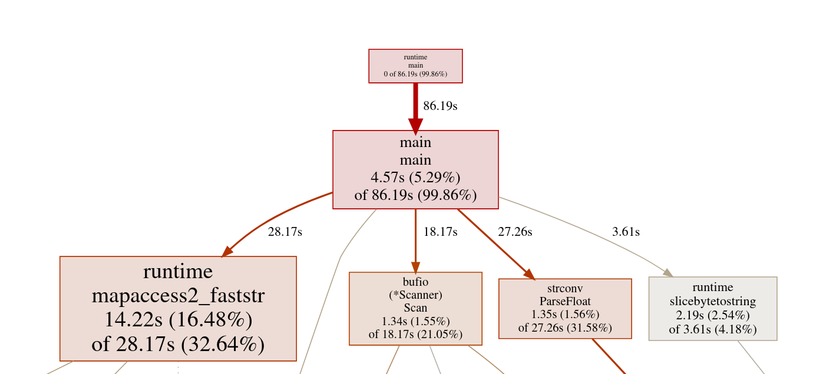
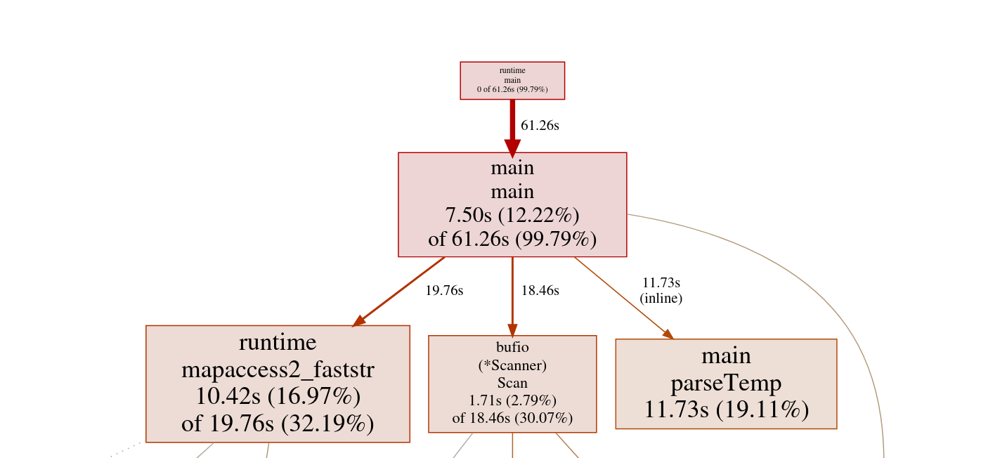
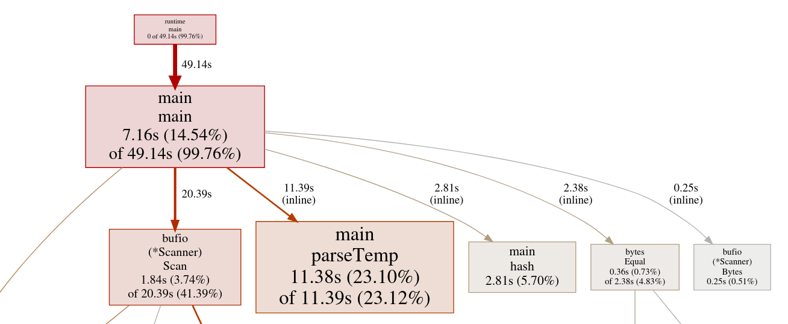

# GoProfiling

## Week 1
Wrote a very basic solution to test the correctness. The initial tests were run on 100M rows and it completed in ~13 seconds. Now running it on 1 Billion rows is taking ~2min 10seconds.

## Week 2
* Added Profiling to the code
* Read Bytes instead of string

| Bottleneck | Impact (~%) | Root Cause | Plan |
| :--- | :--- | :--- | :--- |
| **Memory Allocation** | 28% | Creating new strings/slices for every line. | Switch to `scanner.Bytes()`; reuse buffers. (Done) |
| **String Splitting** | 23% | `strings.SplitN` is too generic and allocates. | Manually find the `;` delimiter in byte slice. |
| **Map Lookups** | 22% | Hashing and comparing string keys is slow. | Reduce unnecessary byte-to-string conversions. |
| **Float Parsing** | 18% | Standard library parsing is overkill for simple data. | Use custom integer-based parsing. |

Running for 1 Billion takes ~1m23sec

## Week 3

* Added a custom float parsing function (Reduced Runtime by very small amount)




Parsing is still taking considerable amount of time. I need to look into whether i can make parsing faster than this or not. The main problem seems that even if th parseFloat portion reduced from 27 seconds to 11 seconds, somehow the slicebytetostring started taking more time. My best guess is that this is an effect of pipelining. 

## Week 4

* Inlined byte-to-string conversion

Earlier I was using this line `stationName := string(stationNameBytes)` which allocated a new string in the heap even if the station already exists. I learnt that if we do, `stats, exists := statsMap[string(stationNameBytes)]` directly then, the compiler completely avoids allocation by some kind of optimization. By running the profiling again, we can see that the byte-to-string block is completely removed and we removed a clean 17 seconds.



* Using custom hashmap

After using custom hashmap, we dropped another 12 seconds. The builtin map provides a lot of protection from collisions. We dont need them. Again, we see that we are using most of our time in the float method. 



* Used integers instead of floats saved 2 more seconds (only)
* Removing branch shaves 2 seconds


```
 	if negative {
 		return -temp
 	}
 	return temp
    ------------- Changed to --------------

	return temp * sign
```

* Added a custom delimiter instead of bytes.IndexByte 


## Week 5

Implemented parallelism in the code. Now it takes only 6.66 seconds to run on 1 Billion Rows. 

Number of workers = 16 (Num of threads in CPU)
First I thought to use a single map and use locks to update the hashtable by each thread. But this was a slow approach. 

The optimized approach was using something similar to Map-Reduce. Each goroutine takes a chunk of the input file and maintains its own hashtable. Finally after each of these goroutines exit we will merge these maps to generate the final output. 

* Saved 0.5seconds by storing the 64bit hash and comparing that before comparing the key